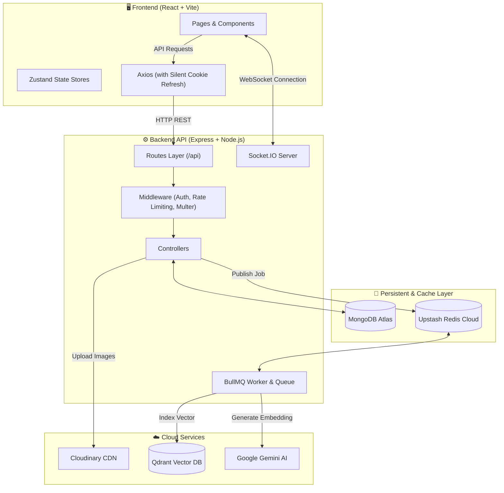
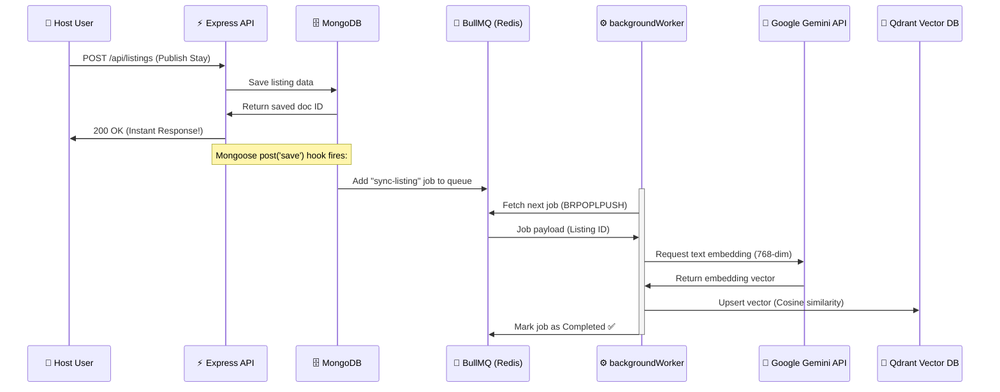
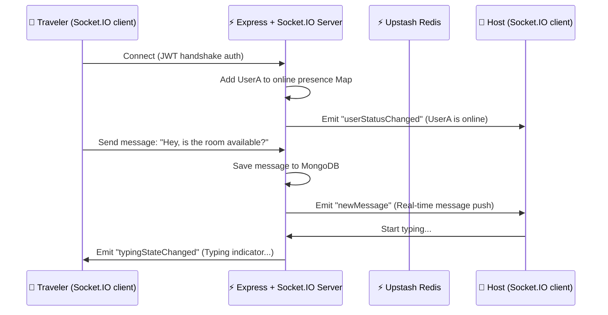

# NomadStay
### NomadStay
A full-stack social travel platform for finding and hosting stays.

     

| Backend | Frontend | Focus |
|---|---|---|
| Express API, MongoDB, BullMQ, Socket.IO, Cloudinary, Qdrant | Vite, React Router, Tailwind, Zustand, MapLibre, Socket.IO | Stay hosting, real-time chat, AI semantic search, and admin management |

---

## Overview

NomadStay connects travelers with hosts offering stays around the world. It combines a cookie-based Express API with a React dashboard so the experience stays fast, real-time, and focused on connecting people for social travel experiences.

---

## What the app covers

### Tech Stack

| Layer | Technologies |
|---|---|
| **Backend** | Node.js, Express, MongoDB, Mongoose, BullMQ, ioredis, Socket.IO, cookie-parser, cors, jsonwebtoken, bcryptjs, multer, multer-storage-cloudinary, cloudinary, passport, passport-google-oauth20, express-rate-limit, nodemailer, node-cron, twilio, @google/genai, @qdrant/js-client-rest, @bull-board/express |
| **Frontend** | React 19, Vite, React Router, Axios, Zustand, Tailwind CSS, React Hook Form, MapLibre GL, react-map-gl, supercluster, use-supercluster, socket.io-client |
| **Tooling** | Nodemon, oxlint, PostCSS, autoprefixer |

---

## Feature Highlights

| Area | Highlights |
|---|---|
| **Authentication** | Cookie-JWT auth with access + refresh tokens, Google OAuth 2.0, email verification, password reset, session bootstrap on page load |
| **Listings** | Create, edit, list, view, and delete stay listings with multi-image upload (up to 5), amenities, GeoJSON location, and map view |
| **Stay Requests** | Request-to-stay flow with pending → approved → rejected → completed lifecycle and host notifications |
| **Real-time Chat** | Socket.IO bidirectional messaging, typing indicators, read receipts, online presence tracking, and room-based conversations |
| **Notifications** | Real-time push via Socket.IO, in-app notification bell with unread count, and persistent notification history |
| **Reviews** | Post-stay review system with star ratings, compound unique index preventing double reviews |
| **AI Search** | RAG-powered semantic listing search using Gemini embeddings + Qdrant vector DB with LLM re-ranking |
| **Admin Panel** | Admin dashboard for user management (verify, ban), listing moderation, and review oversight |
| **Image Uploads** | Dual-mode storage — Cloudinary CDN in production, local disk fallback in development, with face-detection avatar cropping |
| **Background Jobs** | BullMQ + Redis for async Qdrant vector sync, with Bull-Board live dashboard at `/admin/queues` |
| **Security** | Rate limiting, AES-256-CBC field encryption on travel notes, bcrypt password hashing, JWT with httpOnly cookies |

---

## Architecture

### High-Level System Architecture



### Asynchronous Vector Sync Pipeline



### Real-Time Messaging & Presence Flow



---

### Backend Flow

The backend follows an MVC pattern with routes, controllers, middleware, and models. Routes mount under `/api`, then controllers handle request/response while Mongoose models manage the data layer. Middleware handles JWT auth, admin checks, file uploads, and rate limiting.

BullMQ workers process background jobs using Redis as the queue engine. When a listing is created, a `post("save")` Mongoose hook pushes a job to BullMQ, which generates a 768-dimension embedding via Gemini and indexes it in Qdrant for semantic search.

Socket.IO runs on the same HTTP server with JWT handshake authentication. It manages user presence, room-based conversations, typing indicators, and out-of-band notification delivery.

### Frontend Flow

The frontend uses a shared Axios client pointed at `VITE_API_URL` and sends credentials so cookie auth works end to end. An interceptor automatically attaches the access token and silently refreshes it on 401 responses. Protected routes render the main layout, while Zustand stores manage auth, chat, and notification state across the app.

---


## Backend Features

- Cookie-based authentication with access + refresh JWT tokens
- Google OAuth 2.0 login via Passport.js
- Email verification and password reset with Nodemailer
- Phone OTP verification via Twilio
- Listing management with multi-image Cloudinary upload and GeoJSON 2dsphere indexing
- Stay request lifecycle (pending, approved, rejected, completed, expired)
- Real-time chat with Socket.IO (JWT handshake, rooms, presence, typing indicators)
- In-app notification system with real-time delivery
- Review system with compound unique index preventing duplicates
- RAG semantic search using Gemini embeddings + Qdrant vector similarity
- BullMQ background workers for async vector sync with Bull-Board dashboard
- Admin endpoints for user verification, banning, and content moderation
- Rate limiting on all `/api` routes (200 req / 15 min per IP)
- AES-256-CBC encryption on sensitive travel history fields
- Node-cron scheduled jobs for expiring stale stay requests
- Health check endpoint at `/api/health`

## Frontend Features

- Auth pages for login, registration, Google OAuth callback, email verification, and password reset
- Protected dashboard shell with shared navigation and notification bell
- Landing page with hero section and feature highlights
- Home page with listing grid, search filters, and AI-powered semantic search
- Listing detail page with photo gallery, map view, amenities, and stay request form
- Create and edit listing forms with multi-image upload and drag controls
- User profile page with avatar upload, bio editing, gov-ID verification, and phone OTP
- Public profile page with hosted listings and reviews
- Real-time messaging page with conversation list and live chat
- Stay request management with status tracking and action controls
- Admin dashboard with user management, listing moderation, and review oversight
- Zustand stores for auth state, chat state, and notification state
- Axios interceptor with silent JWT refresh on token expiry
- MapLibre GL map with marker clustering via Supercluster
- Tailwind CSS with custom design tokens and responsive layouts

---

## API Surface

| Route | Purpose |
|---|---|
| `/api/auth` | Register, login, logout, Google OAuth, email verify, password reset, refresh token |
| `/api/listings` | Listing CRUD, RAG semantic search |
| `/api/users` | Profile read/update, avatar upload, gov-ID upload, phone OTP |
| `/api/stay-requests` | Stay request create, approve, reject, complete |
| `/api/reviews` | Create and list reviews for stays |
| `/api/conversations` | Conversation list and message history |
| `/api/notifications` | Notification list, mark as read |
| `/api/admin` | Admin user management, listing moderation, review oversight |
| `/api/hosts` | Host profile and listing data |
| `/api/history` | Travel history with encrypted private notes |
| `/api/health` | Health check |
| `/admin/queues` | BullMQ live dashboard (Bull-Board) |

---

## Project Structure

```
project/
├── backend/
│   ├── config/           # MongoDB, Cloudinary, Passport, Mailer
│   ├── controllers/      # Auth, Listing, Profile, StayRequest, Review, Admin, Chat, Notification
│   ├── jobs/             # Node-cron scheduled jobs (expire requests)
│   ├── middleware/        # JWT auth (protect), admin check, file upload (Multer/Cloudinary), rate limiter
│   ├── models/           # Mongoose schemas (User, HostListing, StayRequest, Review, Conversation, Message, Notification, TravelHistory)
│   ├── routes/           # Express routers for all API endpoints
│   ├── scripts/          # Data sync and wipe utilities
│   ├── services/         # Qdrant vector search service
│   ├── sockets/          # Socket.IO chat handler (presence, rooms, typing, notifications)
│   ├── workers/          # BullMQ queue + worker + Redis client
│   └── server.js         # App entry point (Express + Socket.IO + BullMQ + Bull-Board)
└── frontend/
    └── src/
        ├── components/   # Navbar, ChatBubble, MapComponent, ReviewCard, StayRequestForm, ImageUploader, NotificationDropdown, admin/
        ├── hooks/        # useAuthBootstrap, useSocket
        ├── pages/        # Landing, Home, Login, Register, Profile, Listings, Messages, StayRequests, admin/
        ├── services/     # API client (Axios + interceptors), auth, listing, profile, conversation, review, geocode, stayRequest, host
        └── store/        # Zustand stores (auth, chat, notifications)
```

---

## Setup

| Package | Command |
|---|---|
| **Backend** | `cd backend` → `npm install` → `npm run dev` |
| **Frontend** | `cd frontend` → `npm install` → `npm run dev` |

---

## Environment Variables

### Backend

| Variable | Purpose |
|---|---|
| `PORT` | Server port |
| `MONGO_URI` | MongoDB connection string |
| `JWT_ACCESS_SECRET` | Access token signing secret |
| `JWT_REFRESH_SECRET` | Refresh token signing secret |
| `JWT_ACCESS_EXPIRES` | Access token lifetime |
| `JWT_REFRESH_EXPIRES` | Refresh token lifetime |
| `CLIENT_URL` | Allowed frontend origin for CORS |
| `GOOGLE_CLIENT_ID` | Google OAuth client ID |
| `GOOGLE_CLIENT_SECRET` | Google OAuth client secret |
| `GOOGLE_CALLBACK_URL` | Google OAuth redirect URI |
| `CLOUDINARY_CLOUD_NAME` | Cloudinary cloud name |
| `CLOUDINARY_API_KEY` | Cloudinary API key |
| `CLOUDINARY_API_SECRET` | Cloudinary API secret |
| `TWILIO_ACCOUNT_SID` | Twilio account SID for phone OTP |
| `TWILIO_AUTH_TOKEN` | Twilio auth token |
| `TWILIO_PHONE_NUMBER` | Twilio sender phone number |
| `GEMINI_API_KEY` | Google Gemini API key for embeddings and re-ranking |
| `QDRANT_URL` | Qdrant vector database endpoint |
| `QDRANT_API_KEY` | Qdrant API key |
| `REDIS_URL` | Redis connection URL (Upstash) for BullMQ |
| `SMTP_HOST` | SMTP mail server host |
| `SMTP_PORT` | SMTP mail server port |
| `SMTP_USER` | SMTP username |
| `SMTP_PASS` | SMTP password |
| `SMTP_SECURE` | SMTP TLS flag |
| `MAIL_FROM` | Email sender address |

### Frontend

| Variable | Purpose |
|---|---|
| `VITE_API_URL` | Base URL for the backend API |

---

## Deployment Notes

- The frontend is a SPA — all routes should rewrite to `index.html` for client-side routing.
- The backend should run with MongoDB available and Redis connected for BullMQ job processing.
- Cookie-based auth requires the frontend origin to match `CLIENT_URL` and Axios to use `withCredentials: true`.
- Cloudinary credentials enable cloud image storage; without them, uploads fall back to local disk (`./uploads/`).
- Qdrant and Gemini API keys are required for AI-powered semantic listing search.
- The BullMQ dashboard is available at `/admin/queues` for monitoring background job processing.

---

## Project Notes

- MVC-style separation is used across routes, controllers, models, and middleware.
- Business logic is split between controllers and Mongoose hooks to keep the codebase focused.
- BullMQ decouples heavy AI operations (embedding generation) from the request-response cycle.
- Socket.IO uses JWT handshake authentication — no anonymous connections are allowed.
- The dual-mode upload system (Cloudinary vs local disk) allows development without cloud credentials.
- Rate limiting and field encryption are applied for production-grade security.

**NomadStay is built to make social travel connections visible, real-time, and easy to manage.**
